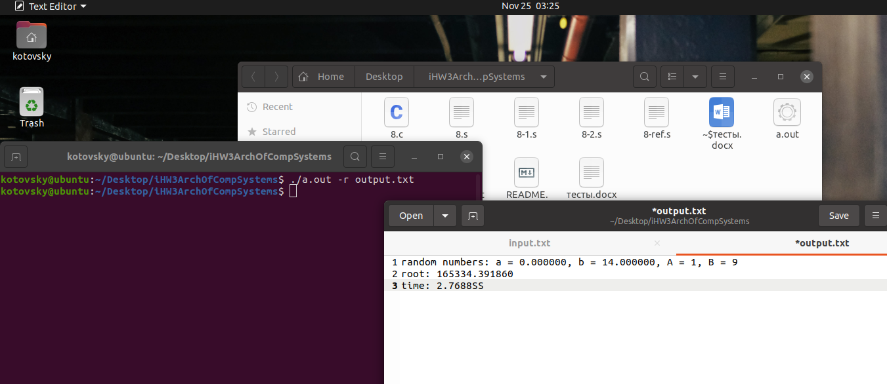

## Архитектура вычислительных систем
### Индивидуальное домашнее задание №3
##### Вариант 28


##### Котовский Семен Олегович, БПИ219
24 ноября 2022 г.


<b>Задание</b>: Разработать программу численного интегрирования функции y = a + b * x^4 (Задаётся действительными числами a,b) в определенном диапазоне целых (задаётся так же) методом прямоугольников с избытком (точность вычислений = 0.0001).

## Отчёт о выполнении

### Примечание для тестирования:

Для корректной работы программы нужно использовать один из видов ввода:

./a.out -s output.txt <br>
2 4 5 10

./a.out -r output.txt

./a.out -f input.txt output.txt

./a.out -h - вывод справки.

#### 4	балла
Задача решена на 8 баллов, но все изменения на предыдущие оценки содержатся в итоговых файлах.
<li>	Приведено решение задачи на C.</li>


```c
#include <stdio.h>
#include <stdlib.h>
#include <time.h>
#include <string.h>

double f(double a, double b, double x) {
    return a + b * x * x * x * x;
}

double S(double a, double b, int A, int B) {
    int n = 100000000;
    double h = (float) (B - A) / n;
    double sum = 0.0;
    for (int i = 0; i < n; i++) {
        sum += f(a, b, A + i * h);
    }
    return h * sum;
}

int main(int argc, char *argv[]) {
    if ((argc != 2) && (argc != 4) && (argc != 3)) {
        printf("Некорректный ввод!\n");
        return 0;
    }
    clock_t start, end;
    if (strcmp(argv[1], "-r") == 0) {
        if (argc != 3) {
            printf("Некорректный ввод!\n");
            return 0;
        }
        srand(time(NULL));
        FILE *out = fopen(argv[2], "w");
        if ((out == NULL)) {
            printf("файл некорректный, либо не существует!\n");
            return 0;
        }
        double a = (rand() % 10);
        double b = (rand() % 15);
        int A = (rand() % 15 - 10);
        int B = (rand() % 15);
        fprintf(out, "random numbers: a = %lf, b = %lf, A = %d, B = %d\n", a, b, A, B);
        start = clock();
        double s = S(a, b, A, B);
        end = clock();
        fprintf(out, "root: %lf\ntime: %.4lf\n", s, (double) (end - start) / (CLOCKS_PER_SEC));
        fclose(out);
    } else if (strcmp(argv[1], "-h") == 0) {
        printf("\n-h вывести справку\n");
        printf("-r Содать случайные коэффициенты и границы\n");
        printf("-f считать данные из input.txt и записать результат в output.txt\n");
        printf("-s Считать данные из терминала и записать в файл.\n");
    } else if (strcmp(argv[1], "-f") == 0) {
        if (argc != 4) {
            printf("Некорректный ввод!\n");
            return 0;
        }
        FILE *input = fopen(argv[2], "r");
        FILE *out = fopen(argv[3], "w");
        if ((input == NULL) || (out == NULL)) {
            printf("Некорректный файл!\n");
            return 0;
        }
        double a, b;
        int A, B;
        fscanf(input, "%lf", &a);
        fscanf(input, "%lf", &b);
        fscanf(input, "%d", &A);
        fscanf(input, "%d", &B);
        start = clock();
        double s = S(a, b, A, B);
        end = clock();
        fprintf(out, "integral = %lf\ntime: %.4lf\n", s, (double) (end - start) / (CLOCKS_PER_SEC));
        fclose(input);
        fclose(out);
    } else if ((strcmp(argv[1], "-s") == 0)) {
        if (argc != 3) {
            printf("Некорректный ввод!\n");
            return 0;
        }
        FILE *out = fopen(argv[2], "w");
        if ((out == NULL)) {
            printf("Некорректный файл!\n");
            return 0;
        }
        double a, b;
        int A, B;
        scanf("%lf", &a);
        scanf("%lf", &b);
        scanf("%d", &A);
        scanf("%d", &B);
        start = clock();
        double s = S(a, b, A, B);
        end = clock();
        fprintf(out, "integral = %lf\ntime: %.4lf\n", s, (double) (end - start) / (CLOCKS_PER_SEC));
        fclose(out);
    }
    return 0;
}


```

Код находится в файле 8.c
Далее в командную строку вводим данные команды для получения искомого ассемблерного файла, а также исполняемого файла.
$gcc -O0 -Wall -fno-asynchronous-unwind-tables 8.c -o main
$gcc -O0 -Wall -fno-asynchronous-unwind-tables -S 8.c -o 8.s
$gcc 8.s -o
Необходимые комментарии находятся в 8.s

Пример считывания и записи данных в файлы:


Тестовое покрытие представлено в разделе "8 баллов".

#### 5	баллов
<br>
В дополнение к требованиям на предыдущую оценку

##### Функциональность:
●	double S(double a, double b, int A, int B) - получает на вход коэффициенты и границы.
Возвращает double - значение интеграла на отрезке.

●	double f(double a, double b, double x)  - получает на вход коэффициенты и возвращает требуемое уравнение.

##### Комментарии:
В ассемблерную программу при вызове функций были добавлены
комментарии, которые описывают передачу фактических параметров и перенос возвращаемого результат.
В этой программе не использовались формальные параметры.
Комментарии содержатся в файле 8.s

#### 6 баллов
В дополнение к требованиям на предыдущую оценку
Я сделал рефакторинг программы на ассемблере за счет максимального использования регистров процессора. <br> <br> Измененная программа сохранена в файле “8-ref.s”. <br><br> В процессе рефакторинга соотвественно были изменены команды (например movl -> movq), а также были изменены регистры, которые контактировали с “новыми” регистрами.
Также были добавлены комментарии, которые поясняют использование регистров в соответствии с переменными из исходной программы на С. Например #rbx = A и т.д

Тестовое покрытие представлено в разделе "8 баллов".

#### 7 баллов

Реализация программы на ассемблере, полученной после рефакторинга, в виде двух единиц компиляции (8-1.s & 8-2.s).

Я разделил код ассемблера на файл с функциями и файл с main. Далее скомпилировал полученные файлы и запустил файлы с исходными данными и файла для вывода результатов с использованием аргументов командной строки.

Программа работает с ключами -h, -f, -r, -s.


#### 8 баллов

Тестовое покрытие для всех файлов:


Все случаи некорректного ввода успешно "отлавливаются программой"


• В программу добавлен функционал для генерации случайных наборов данных (коэффициентов и границ).

Для корректной работы программы, запускать её необходимо с указанием одного из ключей (-h, -r, -f, -s)


Пример работы случайной генерации:


• Также реализована навигация в командной строке с выбором требуемых функций через ключи, указанные выше:


```c
else if (strcmp(argv[1], "-h") == 0) {
        printf("\n-h вывести справку\n");
        printf("-r Создать случайные коэффициенты и границы\n");
        printf("-f считать данные из input.txt и записать результат в output.txt\n");
        printf("-s Считать данные из терминала и записать в файл.\n");
    } 
```

• Программа была модифицирована добавлением функционала для вычисления времени.


Время работы программы было увеличено при помощи искусственного выполнения цикла множественное число раз.
```c
int n = 100000000;
    double h = (float) (B - A) / n;
    double sum = 0.0;
    for (int i = 0; i < n; i++) {
        sum += f(a, b, A + i * h);
    }
```

Финальная версия программы сохранена в 8.c
